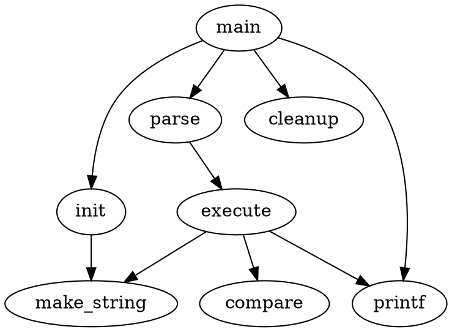

`Markdown` 高级用法, 需要额外的库才可以实现

<!--more-->

## 0x00 TOC 目录

在 `markdown` 文本中添加 `[TOC]`, 则会自动在该位置生成文档目录, 使用后的效果请见文章最上方

## 0x01 Todos 任务

可以在你的 `markdown` 中插入一些带有 `CheckBox` 的任务, 使用语法: `[ ] First task`

如下:

* [ ] Read a book.
* [x] Finish my homework.

## 0x02 Footnote 脚注

Something like `aaa[^1]`

* Test footer note<sup><a id="fn1b" href="#fn1">note1</a></sup>
* Test message<sup><a id="fn2b" href="#fn2">note2</a></sup>
* shit[^22]

1. <a id="fn1" href="#fn1b">note1</a>: Blabla
2. <a id="fn2" href="#fn2b">note2</a>: Bla
3. [^22]: aaa

## 0x03 LaTex 数学公式

可以通过使用 `$` 包裹行内公式, 或者使用 `$$` 包裹多行公式, 来实现渲染 `Latex` 数学公式, 下面是一些例子

* `$E=mc^2$` 被渲染为: $E=mc^2$
* `$\Gamma(n) = (n-1)!\quad\forall n\in\mathbb N$` 被渲染为: $\Gamma(n) = (n-1)!\quad\forall n\in\mathbb N$

```
$$
\Gamma(z) = \int_0^\infty t^{z-1}e^{-t}dt\,.
$$
```
渲染结果为:

$$
\Gamma(z) = \int_0^\infty t^{z-1}e^{-t}dt\,.
$$

## 0x04 UML 时序图

比如这样写:

```
​```sequence
participant Andrew
participant China
Andrew-China: Says Hello
Note right of China: China thinks\nabout it
China--Andrew: How are you?
Andrew-China: I am good thanks!
​```
```

得到的时序图为:

```sequence
participant Andrew
participant China
Andrew-China: Says Hello
Note right of China: China thinks\nabout it
China--Andrew: How are you?
Andrew-China: I am good thanks!
```

更多语法请参考官方文档: [https://bramp.github.io/js-sequence-diagrams/](https://bramp.github.io/js-sequence-diagrams/)

## 0x05 Flowchart 流程图

比如这样写

```
​```flow
st=>start: Start
e=>end
op=>operation: My Operation
cond=>condition: Yes or No?

st->op->cond
cond(yes)->e
cond(no)->op
​```
```

得到的流程图为:

```flow
st=>start: Start
e=>end
op=>operation: My Operation
cond=>condition: Yes or No?

st->op->cond
cond(yes)->e
cond(no)->op
```

更多语法请参考官方文档: [http://flowchart.js.org/](http://flowchart.js.org/)

## 0x06 Graphviz

比如这样写:

```
digraph G {
  main -> parse -> execute;
  main -> init;
  main -> cleanup;
  execute -> make_string;
  execute -> printf
  init -> make_string;
  main -> printf;
  execute -> compare;
}
```

渲染出来的图为:



更多语法请参考官方文档: [https://www.graphviz.org/](https://www.graphviz.org/)
